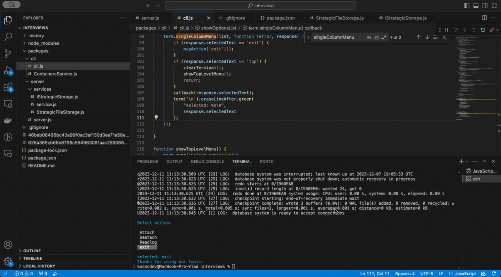

# Docker Container Log Manager

## Description
This Node.js utility provides two main functionalities:
- A CLI for interacting with Docker containers to attach, detach, and read logs.
- A Fastify-based server for managing containers and their logs.

## Prerequisites
- Node.js installed on your machine.
- Docker installed and running.
- Access to Docker's remote API if you are managing remote containers.

## Installation
1. Clone the repository or download the source code.
2. Navigate to the project directory and run `npm install` to install dependencies.

## Usage

### Server
The server provides an API to manage Docker containers and their logs.
- **Start the Server**:
  - Run `npm run start:server` to launch the Fastify server.
  - The server will be available at `http://localhost:3000`.

### CLI
The CLI provides a command-line interface for real-time interaction with Docker containers.
- **Start the CLI**:
  - Run `npm run start:cli` to launch the CLI.

### Available Commands
- `Attach`: Attach to a Docker container to start logging.
- `Detach`: Detach from a Docker container to stop logging.
- `Readlog`: Read and display logs from an attached Docker container.
- `exit`: Exit the utility.

### Interacting with the Utility
- The utility provides an interactive menu. Use the arrow keys to navigate and select an option.
- Follow the prompts to attach or detach from containers, or to read logs.

### Running Order
- To manage containers, start the server first with `npm run start:server`.
- Then, use the CLI to interact with the server and manage container logs.

## Additional Notes
- Ensure Docker is running and accessible by the script.
- This script assumes logs are saved in files named `<container_id>_logs.txt`.

## License
This project is licensed under the ISC License.
